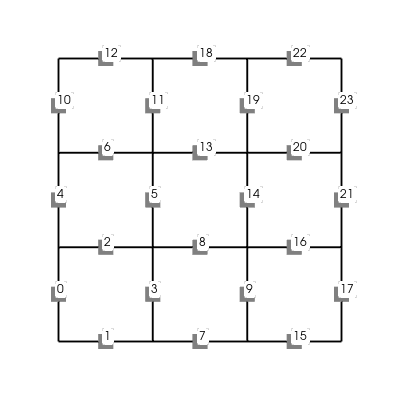
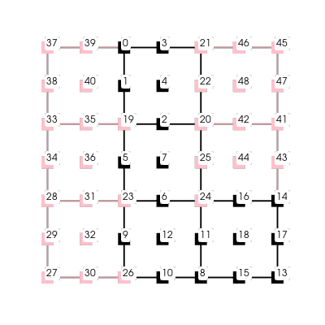

# febug

`febug` is a collection of tools designed for **f**inite **e**lement 
de**bug**ing. The paradigm here is to check code written for use with 
[`dolfinx`](https://github.com/FEniCS/dolfinx) which may yield unexpected, 
erroneous or undesireable results as a consequence of numerical scheme 
errors rather than syntax errors.

## Usage

You can import `febug` and call the library functions to check your code
manually. You may also wish to have your script automatically checked
by injecting `febug` into your `dolfinx` script

```python
import febug
febug.overload_dolfinx()
febug.error_on_issue = False
```

Selecting `febug.error_on_issue = True` will raise an `FebugException` each 
time `febug` detects a potential issue.

### Performance

Debugging is expensive. `febug` is **not** intended to be used with large scale 
production code. Use `febug` with small problems to ensure the sane and safe 
solution of your finite element problem in an abstract setting.

### Nonlinear problem example

A typical 'gotcha' arising in nonlinear finite element problems is 
unresolved singularities because of a zero initial guess. Specifically when 
we employ Newton's iterative method, a zero initial guess will yield 
singularities when assembling the system residual or Jacobian with material 
coefficients which depend on the inverse of the solution. Consider the 
following snippet

```python
import febug
febug.overload_dolfinx()
febug.error_on_issue = True

import dolfinx, ufl
import mpi4py as MPI

mesh = dolfinx.mesh.create_unit_square(MPI.COMM_WORLD, 4, 4)
V = dolfinx.fem.FunctionSpace(mesh, ("CG", 1))
v = ufl.TestFunction(V)

u = dolfinx.fem.Function(V)
u.interpolate(lambda x: x[0]*x[1])

F = ufl.inner(1 / u, v) * ufl.dx

problem = dolfinx.fem.petsc.NonlinearProblem(F, u)
problem = dolfinx.nls.petsc.NewtonSolver(mesh.comm, problem)
```

which yields the following error:

```
Traceback (most recent call last):
  File "$PWD/febug/examples/demo_bad_fe_problem.py", line 31, in <module>
    problem = dolfinx.fem.petsc.NonlinearProblem(F, u, bcs)
  File "$PWD/febug/febug/dolfinx/fem/petsc.py", line 19, in __init__
    febug.dolfinx.nls.search_for_potential_singularity(self.L)
  File "$PWD/febug/febug/dolfinx/nls/__init__.py", line 19, in 
  search_for_potential_singularity
    febug.report_issue(f"Singularities found:\n" + "\n".join(
  File "$PWD/febug/febug/__init__.py", line 24, in report_issue
    raise FebugError(msg)
febug.FebugError: Singularities found:
u at DoFs [ 0  1  4  8 13 15 19 22 24]
```

## Plotting

A number of utility methods are provided for plotting using
[`pyvista`](https://github.com/pyvista/pyvista). These are intended for rapidly
debugging **small** finite element problems. It is emphasised here that these
plotting methods are not intended for visualising large or intricate finite
element models. For visualisation of finite element models custom code written
with [`pyvista`](https://github.com/pyvista/pyvista) or external packages such
as [paraview](https://www.paraview.org/) are recommended.

Consider the following examples where serial and parallel with two processes
runs are demonstrated

```python
mesh = dolfinx.mesh.create_rectangle(
    MPI.COMM_WORLD, ((0.0, 0.0), (1.0, 1.0)), (3, 3),
    dolfinx.mesh.CellType.quadrilateral,
    dolfinx.mesh.GhostMode.shared_facet)
```

- Mesh:

    ```python
    febug.plot_mesh(mesh)
    ```

    | Serial    | Process 0 | Process 1 |
    | --------- | --------- | --------- |
    |  |  |  |

- Mesh entity indices:

    ```python
    for tdim in range(mesh.topology.dim):
        febug.plot_entity_indices(mesh, tdim)
    ```

    | Dim | Serial    | Process 0 | Process 1 |
    | --- | --------- | --------- | --------- |
    | 0 |  |  |  |
    | 1 |  |  |  |
    | 2 |  |  |  |

- DoF maps:

    ```python
    V = dolfinx.fem.FunctionSpace(mesh, ("CG", 2))
    febug.plot_dofmap(V)
    ```

    | Element | Serial    | Process 0 | Process 1 |
    | ------- | --------- | --------- | --------- |
    | CG1     |   |   |   |
    | CG2     |   |   |   |
    | DG0     |   |   |   |
    | DPC1    |  |  |  |
    | Bubble  |  |  |  |
    | CR      |  |  |  |

- Function DoF values:

    ```python
    V = dolfinx.fem.FunctionSpace(mesh, ("CG", 2))
    u = dolfinx.fem.Function(V)
    u.interpolate(lambda x: x[0]*x[1])
    plotter = pyvista.Plotter()
    febug.plot_function(u, plotter=plotter)
    febug.plot_mesh(mesh, plotter=plotter)
    febug.plot_function_dofs(u, plotter=plotter)
    ```

    | Element | Serial    | Process 0 | Process 1 |
    | ------- | --------- | --------- | --------- |
    | CG1     |   |   |   |
    | CG2     |   |   |   |
    | DG0     |   |   |   |
    | DPC1    |  |  |  |
    | Bubble  |  |  |  |
    | CR      |  |  |  |